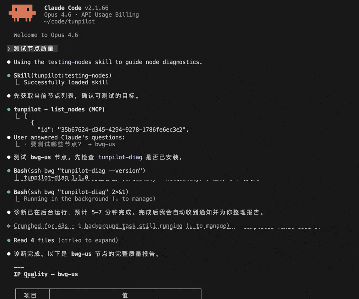

# TunPilot

Agent-native 代理节点管理服务。通过 MCP (Model Context Protocol) 提供 Hysteria2 / Xray(Trojan) 节点的全生命周期管理，专为 LLM Agent 设计，无传统 Web UI。

```
用户 → LLM Agent (Claude Code / OpenClaw) → TunPilot MCP → Hysteria2 节点
```

## 核心功能

- **节点管理** — 注册、更新、启用/禁用 Hysteria2 / Xray(Trojan) 代理节点
- **用户管理** — 创建用户、分配节点权限、设置流量配额和有效期
- **订阅生成** — 支持 Sing-box、Clash、Surge 格式（Shadowrocket 自动使用 Surge 配置）
- **流量监控** — 自动从节点同步流量数据，实时配额检查
- **节点诊断** — 通过 SSH 直连节点执行 IP 质量扫描（风控得分、流媒体解锁）和网络测速（路由、延迟）
- **分流规则** — 16 个流量分类（OpenAI / Netflix / CN / Ads 等），支持按分类指定 direct / reject / proxy / 指定节点
- **节点侧认证** — Hysteria2 使用原生 `userpass`，TunPilot 通过 SSH 异步下发配置，不处于鉴权热路径

## 效果演示

无需寻找第三方评测脚本与各种探针面板，所有操作均通过 Agent 在终端中对话完成并渲染输出报告：



## 快速开始

只需两步：安装插件，然后用自然语言让 Agent 完成一切。

### 1. 安装插件

**Claude Code：**

```
/plugin marketplace add https://github.com/Buywatermelon/tunpilot.git
```

```
/plugin install tunpilot@Buywatermelon-tunpilot
```

安装后重启 Claude Code 以加载插件。

**OpenClaw：**

```bash
openclaw plugins install @tunpilot/openclaw-plugin
```

### 2. 对话驱动

安装插件后，直接告诉 Agent 你想做什么：

```
> 帮我在 root@1.2.3.4 上部署 TunPilot 并连接 MCP
```

Agent 会自动加载 `getting-started` skill，引导完成：
1. 验证 SSH 连通性（需要提前配好免密登录）
2. SSH 到你的服务器执行一键部署脚本
3. 配置 MCP 连接
4. 验证连接状态

连接成功后，继续用自然语言管理一切：

```
> 部署一个新的 Hysteria2 节点
> 帮我添加一个新节点，host 是 us1.example.com，端口 443
> 创建用户 alice，流量配额 50GB
> 给 alice 生成 Shadowrocket 订阅链接
> 查看所有用户本月的流量统计
```

## Skill 列表

| Skill | 触发场景 | 作用 |
|-------|---------|------|
| `getting-started` | 部署 TunPilot / 连接 MCP / 首次配置 | 一键部署服务器 + 自动连接 MCP |
| `deploying-hy2-nodes` | 部署 Hysteria2 代理节点 | 提供配置模板和分步操作流程 |
| `deploying-xray-nodes` | 部署 Xray/Trojan 代理节点 | 提供配置模板和分步操作流程 |
| `testing-nodes` | 质量检测 / 网络测速 / IP 风险扫描 | 直连服务器执行 IPQuality 和 NetQuality 诊断，输出节点健康报告 |

## MCP Tools

连接后通过 MCP 暴露 24 个工具，分为六组：

### 节点管理（5 个）
| 工具 | 说明 |
|------|------|
| `list_nodes` | 列出所有节点 |
| `add_node` | 注册新节点（保存 stats / SSH / 订阅所需元数据） |
| `update_node` | 更新节点配置 |
| `remove_node` | 删除节点 |
| `sync_xray_nodes` | 强制同步 Xray/Trojan 节点状态（重启后恢复用） |

### 用户管理（9 个）
| 工具 | 说明 |
|------|------|
| `list_users` | 列出所有用户 |
| `create_user` | 创建用户（Agent 会先确认默认参数） |
| `update_user` | 更新用户配置 |
| `delete_user` | 删除用户 |
| `reset_traffic` | 重置用户已用流量 |
| `assign_nodes` | 批量分配节点（替换已有分配） |
| `add_user_node` | 增量添加单个节点权限 |
| `remove_user_node` | 增量移除单个节点权限 |
| `list_user_nodes` | 列出用户已分配的节点 |

### 订阅管理（4 个）
| 工具 | 说明 |
|------|------|
| `generate_subscription` | 生成订阅链接（singbox / clash / surge / shadowrocket） |
| `list_subscriptions` | 列出用户的所有订阅 |
| `delete_subscription` | 删除/吊销订阅 token |
| `get_subscription_config` | 预览订阅配置内容（调试用） |

### 分流规则（4 个）
| 工具 | 说明 |
|------|------|
| `list_rule_sets` | 列出所有流量分类（16 个：openai / netflix / cn / ads 等） |
| `list_routing_rules` | 列出当前分流绑定 |
| `set_routing_rule` | 创建/更新分流规则（direct / reject / proxy / 指定节点） |
| `remove_routing_rule` | 删除分流规则 |

### 监控（2 个）
| 工具 | 说明 |
|------|------|
| `check_health` | 检查所有节点状态（ping stats API） |
| `get_traffic_stats` | 查询流量统计（支持按用户/节点/时间范围过滤） |

### 设置（3 个）
| 工具 | 说明 |
|------|------|
| `set_setting` | 设置配置项（API key 等） |
| `list_settings` | 列出所有配置（值已脱敏） |
| `delete_setting` | 删除配置项 |

## 架构

```
src/
├── index.ts                 # 入口：启动 HTTP 服务器 + MCP 会话管理 + 流量同步
├── config.ts                # 环境变量配置
├── db/
│   ├── schema.ts            # Drizzle ORM 数据表定义
│   └── index.ts             # 数据库初始化（WAL 模式 + 外键约束）
├── http/
│   └── index.ts             # HTTP 路由（订阅下载、健康检查）
├── mcp/
│   ├── index.ts             # MCP 服务器工厂（注册全部 24 个工具）
│   └── tools/
│       ├── nodes.ts         # 节点管理工具（5 个）
│       ├── users.ts         # 用户管理工具（9 个）
│       ├── subscriptions.ts # 订阅管理工具（4 个）
│       ├── routing.ts       # 分流规则工具（4 个）
│       ├── monitoring.ts    # 监控工具（2 个）
│       └── settings.ts      # 设置工具（3 个）
└── services/
    ├── node.ts              # 节点 CRUD
    ├── user.ts              # 用户 CRUD
    ├── user-ops.ts          # 节点权限分配 + 协议配置同步
    ├── subscription.ts      # 订阅生命周期（生成、列表、删除、token 查询）
    ├── traffic.ts           # 流量同步 + 统计查询
    ├── hysteria/            # Hysteria2 节点同步与 stats 访问
    │   ├── sync.ts          # userpass / trafficStats 配置对账
    │   └── stats.ts         # stats API 访问（支持 SSH 隧道）
    ├── settings.ts          # 配置项管理（API key 等）
    ├── routing/             # 分流规则引擎
    │   ├── catalog.ts       # 16 个流量分类定义
    │   ├── index.ts         # 规则 CRUD
    │   └── resolve.ts       # 规则解析
    ├── formats/             # 订阅格式渲染器（Format Registry 模式）
    │   ├── index.ts         # 格式注册表（shadowrocket → surge 别名）
    │   ├── singbox.ts
    │   ├── clash.ts
    │   └── surge.ts
    └── xray/                # Xray/Trojan 节点管理
        └── sync.ts          # 配置文件同步
```

### 数据模型

```
nodes ──┐
        ├── user_nodes（多对多）──┐
users ──┘                        ├── subscriptions
                                 └── traffic_logs
routing_rules    # 分流规则（key → action 映射）
settings         # 配置项（API key 等）
```

- **nodes** — 代理节点配置（host、port、stats、SSH、订阅元数据等）
- **users** — 用户账号（密码、配额、有效期）
- **user_nodes** — 用户与节点的多对多权限关系
- **subscriptions** — 订阅链接（token + 格式）
- **traffic_logs** — 历史流量记录
- **routing_rules** — 分流规则绑定（流量分类 → 动作）
- **settings** — 系统配置项（API key、token 等，值加密存储）

### Hysteria2 管理流程

```
用户/节点变更 → TunPilot → SSH 写入 Hysteria2 config.yaml
                    ↓
         auth.type = userpass
         trafficStats.listen = 127.0.0.1:9999（有 SSH 时）
                    ↓
            systemctl reload hysteria-server
```

TunPilot 负责维护节点上的 `userpass` 和 `trafficStats` 配置，但不再参与每次连接鉴权。流量采集优先通过 SSH 隧道访问本地 stats 端口，避免暴露到公网。

### HTTP 端点

| 端点 | 用途 |
|------|------|
| `POST /mcp` | MCP Streamable HTTP（Agent 调用入口） |
| `GET /sub/:token` | 订阅配置下载（客户端 → TunPilot） |
| `GET /health` | 健康检查 |

## 技术栈

| 组件 | 技术 |
|------|------|
| 运行时 | [Bun](https://bun.sh) |
| HTTP 框架 | [Hono](https://hono.dev) |
| 数据库 | SQLite（bun:sqlite，WAL 模式） |
| ORM | [Drizzle ORM](https://orm.drizzle.team) |
| MCP SDK | [@modelcontextprotocol/sdk](https://github.com/modelcontextprotocol/typescript-sdk) |

## 环境变量

| 变量 | 默认值 | 说明 |
|------|--------|------|
| `TUNPILOT_PORT` | `3000` | 监听端口 |
| `TUNPILOT_HOST` | `0.0.0.0` | 监听地址 |
| `TUNPILOT_DB_PATH` | `./data/tunpilot.db` | SQLite 数据库路径 |
| `TUNPILOT_BASE_URL` | `http://localhost:3000` | 外部可访问的基础 URL |
| `MCP_AUTH_TOKEN` | *(空)* | MCP 端点 Bearer Token |
| `TRAFFIC_SYNC_INTERVAL` | `300000` | 流量同步间隔，毫秒（默认 5 分钟） |

## 开发

```bash
bun install
bun test
bun run dev
```

## Agent 分发

| 渠道 | 目录 | 说明 |
|------|------|------|
| Claude Code Plugin | [`plugin/`](plugin/README.md) | 分发 Skill + MCP 配置模板 |
| OpenClaw Plugin | [`openclaw/`](openclaw/README.md) | 分发 Skill + Gateway MCP 注册 |

两个渠道共享 `skills/` 目录下的 Skill 内容，发布时由 CI 复制到各分发目录。

```
skills/
├── getting-started/              # 部署服务 + 连接 MCP
│   └── SKILL.md
├── deploying-hy2-nodes/          # 部署 Hysteria2 节点
│   ├── SKILL.md
│   └── hysteria2-template.md
├── deploying-xray-nodes/         # 部署 Xray/Trojan 节点
│   ├── SKILL.md
│   └── xray-template.md
└── testing-nodes/                # 节点诊断与测速
    └── SKILL.md
```

## License

MIT
